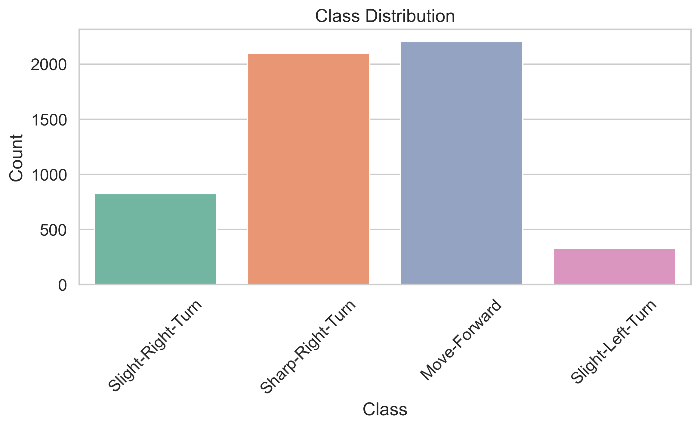
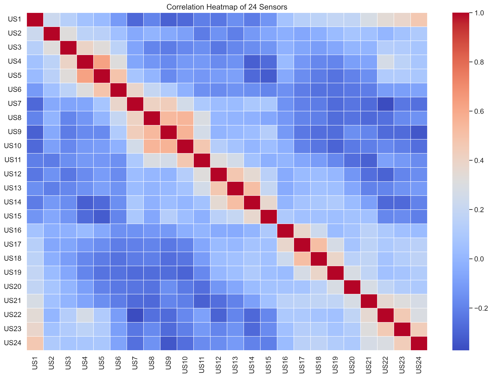
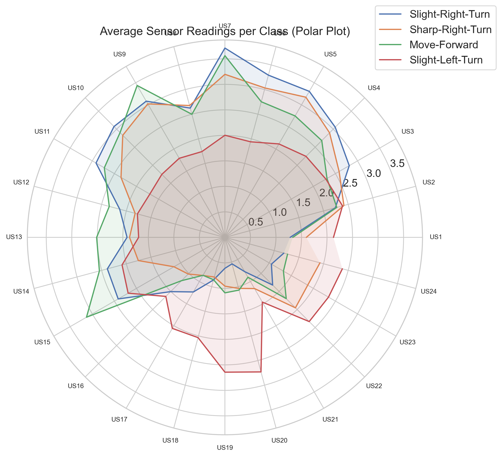

⭐ Wall-Following Robot Navigation – Exploratory Data Analysis (EDA)

This repository contains a complete Exploratory Data Analysis (EDA) of the Wall-Following Robot Navigation Dataset, collected using the SCITOS-G5 mobile robot equipped with 24 ultrasonic sensors arranged in a 360° ring around the robot.

The goal is to understand environmental perception, class behavior patterns, and non-linear relationships between sensor readings and robot navigation actions.

📁 Dataset Overview
Samples: 5,456
Features: 24 ultrasonic sensor readings (US1–US24)
Target Labels:

Move-Forward

Slight-Right-Turn

Sharp-Right-Turn

Slight-Left-Turn

The data represents the robot performing a clockwise wall-following task, where each label corresponds to a steering command.

📊 Exploratory Data Analysis (EDA)

Below is the complete set of visual analysis plots with interpretations.

🔹 1. Class Distribution

This plot reveals a moderate class imbalance:

Move-Forward and Sharp-Right-Turn dominate

Slight-Left-Turn is the minority class

This suggests class-weighting or resampling may be beneficial during model training.

🔹 2. Correlation Heatmap of 24 Sensors

The correlation matrix clearly shows block correlations, where neighboring sensors in physical space exhibit strong positive correlation.
This happens because adjacent ultrasonic sensors “see” similar geometry around the robot.

Key Insights

Sensors on the right arc (US17–US24) correlate strongly with each other

Sensors on the left arc (US7–US12) form another correlated block

Opposite sides often show weak or negative correlation

Strong diagonal confirms sensor stability and reliability

🔹 3. Pairplot of Selected Sensors

This pairplot shows non-linear relationships between different regions of the robot’s sensor space.

Interpretation

Sharp-Right-Turn: occurs when right-side sensors (US17, US22) have extremely low values → robot is too close to the right wall

Slight-Left-Turn: low left-side sensor values (US7) → obstacle on left

Move-Forward: moderate, balanced readings across sensors

Overlapping clusters confirm non-linear separability

This matches the original research:

A perceptron cannot learn this task; non-linear models or memory-augmented models are required.

🔹 4. PCA Projection (2D)

The PCA plot shows how the 24-dimensional sensor data behaves under linear projection.

Insights

Classes strongly overlap in PCA space → supports non-linear nature

Slight-Left-Turn forms some isolated pockets

Move-Forward & Sharp-Right-Turn are highly interwoven

This indicates that a linear classifier alone cannot separate these actions.

🔹 5. Polar Plot – Mean Sensor Values per Class

This is a robot-centric 360° representation showing the average environment for each class.

Interpretation

Sharp-Right-Turn: very small distances on right-side sensors

Slight-Left-Turn: low values on left-side arc

Move-Forward: balanced readings across all directions

Slight-Right-Turn: mild right-side proximity

This plot perfectly reconstructs the robot’s perception.

🧠 Summary of Findings
✔ Strong spatial correlation across sensor arcs
✔ Clear geometric meaning to each robot maneuver
✔ Non-linear class boundaries → require SVM (RBF), Neural Networks, or Trees
✔ Class imbalance should be handled during modeling
✔ PCA shows no linear separation
✔ Polar plot confirms wall-following behavior encoded directly in sensor space
